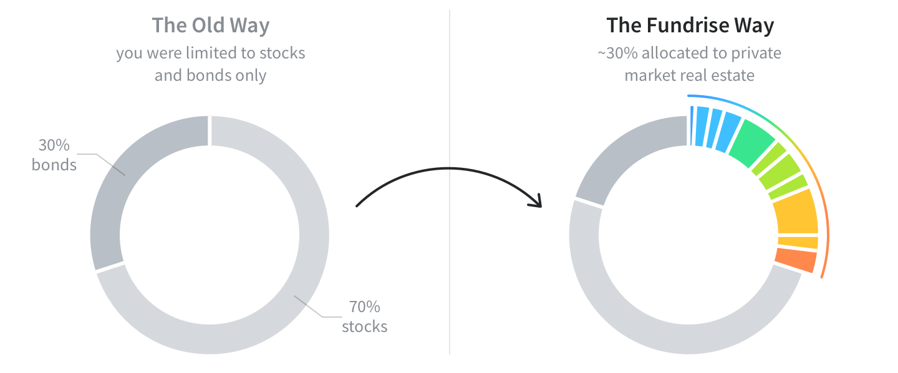
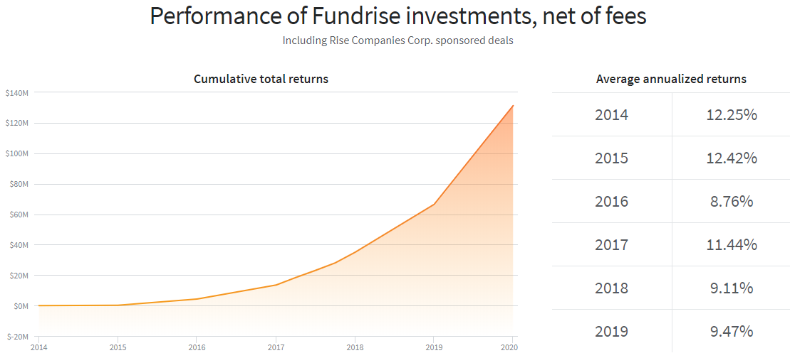

# **Fundrise**

*Founded: 2010*

*Industry: Real Estate Investing, Financial Technology*

*Founders: Dan Miller and Ben Miller*   

---
## *Contents*
1. [Overview](#Overview)
1. [Business Activities](#Business-Activities)
1. [Landscape](#Landscape)
1. [Results](#Results)
1. [Resources](#Resources)
---  
 

## *Overview*

Fundrise is the first investment platform to create a simple, low-cost, and efficient way for anyone to crowdfund investment into the real estate market. It breaks through the traditional real estate investing approach and uses technology to redefine how people invest in real estate. It continues to shape the investment industry, creating a new alternative to investing in stocks and bonds. By combining technology with new federal regulations, it has opened up the once-unattainable world of direct private investments to everyone in the US, regardless of net worth. Today, there are more than 500,000 members of Fundrise, and they have invested in nearly $2 billion worth of real estate across the country.     

## *Business Activities*

With its technological innovations and regulation changes, Fundrise democratize access to private real estate investing, opening up opportunities for everyone.

By cutting out unnecessary overheads in the investment chain and adopting new approaches in real estate investing using online/mobile platforms, it provides better return for investors and reveals new options for potential investors. While most other platforms require people to be accredited investors - meaning they have to meet certain minimum income and/or wealth requirements - Fundrise is open to non-accredited investors, allowing people of nearly any financial situation to invest in private real estate deals. It also has some of the lowest minimums, with a plan that lets people invest as little as $500. While individual non-accredited investors may have a lower degree of liquidity compared to their accredited counterparts, they greatly outnumber accredited investors so there’s a vast swath of opportunity that online marketplaces are positioned to tap into.  

## *Landscape*

In the past 10 years, crowdfunding has become a popular way to fund startups and this type of platform, where many small contributors aggregate up to a meaningful investment, has extended to the real estate market. Fundrise is one of the top 5 real estate crowdfunding companies using technologies to reduce costs for investors and expand its customer base.

What separates Fundrise from many other platforms, however, is that you do not have the option of picking and choosing individual deals to invest in or even choosing from its many REITs - real estate investment trusts - to put your money in. Depending on which of its "core plans" you choose, your money will be invested in multiple Fundrise REITs, each of which is invested in potentially dozens of separate properties.     
   
   
#### Major competitors at a glance :  

|                      |**Fundrise**             |**Realty Mogul**         |**Crowdstreet**|**Rich Uncles**|**PeerStreet**   |
|----------------------|------------------------ |-------------------------|---------------|-------------|-------------|
|**Minimum Investment**|$500                     |$5000                    |$10000         |$0           |$1000        |
|**Account Fees**      | 1%                      |0.3%-0.5%                |0%             |0.5%         |0.25%-1%     |
|**REITs Fees**        | 1%                      |1%-1.5%                  |0%             |3%           |0.25%-1%     |
|**Private REIT**      |Yes                      |Yes                      |No             |No           |No           |
|**Platform Purpose**  |Commercial Residential|Commercial Residential|Commercial     |Commercial   |Residential  |
|**Payout**            |Quarterly                  |Monthly Quarterly   |Depends        |Twice Monthly|Twice Monthly|
  

    

## *Results*

The cumulative total return has been increasing every year while the average annualized return has fluctuated up and down in a 3% range. Although the average annualized return is a helpful guide for measuring a fund's long term performance, investors should also look at a fund's yearly performance to fully appreciate the consistency of its annual total returns.     

## *Resources*

* [About Us, Fundrise](https://fundrise.com/about/)

* [Fundrise Review 2020: Is This Platform Right For You?, Millionacres](https://www.fool.com/millionacres/real-estate-investing/crowdfunding/fundrise-review-commercial-real-estate-crowdfunding/)

* [Real Estate Crowdfunding Trends For 2020 And Beyond, Financial Samurai](https://www.financialsamurai.com/real-estate-crowdfunding-trends-for-2020-and-beyond/)

* [Fundrise Competitors 1, Investor Junkie](https://investorjunkie.com/real-estate/fundrise-vs-realty-mogul-vs-crowdstreet/)

* [Fundrise Competitors 2, Investor Junkie](https://investorjunkie.com/compare/rich-uncles-vs-fundrise-vs-peerstreet/)

* [Fundrise Review, Listen Money Matters](https://www.listenmoneymatters.com/fundrise-review/)

* [Average Annual Return, Investopedia](https://www.investopedia.com/terms/a/aar.asp)   
   
   
-----
-----

    <a href="#top">Back to top</a>
     
    &copy; 2020

